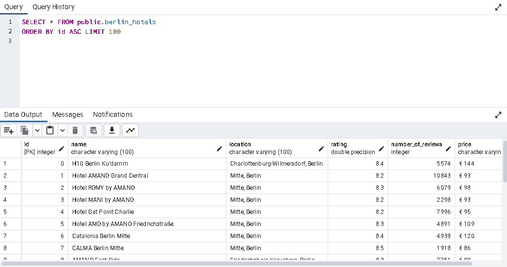

# Web Scraping Project: Hotel Data from Booking.com

## Overview

This project demonstrates a web scraping pipeline using Python to extract hotel data from Booking.com for five major European cities: Paris, London, Berlin, Dublin, and Madrid. The extracted data was transformed and stored in a PostgreSQL database for further analysis.

## Features

- Scraped hotel details including names, locations, ratings, number of reviews and prices.

- Data cleaning and transformation using Pandas.

- Data storage in a PostgreSQL database for querying and analysis.

## Tech Stack

- Python

   - Libraries: BeautifulSoup, Requests, Pandas, Psycopg2

- PostgreSQL

- Jupyter Notebook (for development and testing)

## Steps to Reproduce 

1. Web Scraping

    Tool: BeautifulSoup

    Description: Scraped hotel data for each city from Booking.com.
    
    Data Fields Extracted:
    
    - Hotel Name
    - Location
    - Number of Reviews
    - Rating
    - Price per night

2. Data Transformation

    Tool: Pandas
    
    Description: Cleaned and structured the data for storage.
    
    - Handled missing values.
    - Updated columns to the appropriate data types.

3. Data Loading

    Tool: Psycopg2 and PostgreSQL
    
    Description: Loaded the cleaned data into a PostgreSQL database for analysis.
    
    - Created database schema.
    - Inserted transformed data.

## Results

The resulting database contains structured hotel data that can be queried and analyzed. Below is an example of the database schema:
### Tables

#### Paris Hotels

#### Madrid Hotels

#### London Hotels

#### Dublin Hotels

#### Berlin Hotels

## Future Enhancements

  - Automate the scraping process with a scheduler (e.g., cron or Airflow).

- Implement a web interface for querying the database.

- Use a cloud-based database solution for scalability.

- Add more cities and additional fields.

